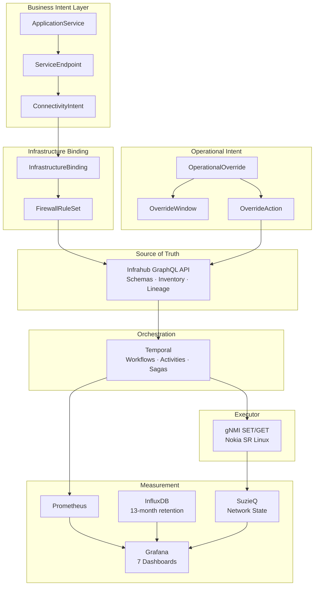

# Network Synapse Quattro

Network automation platform for managing Nokia SR Linux datacenter fabric switches using Infrahub as Source of Truth, Temporal for workflow orchestration, and Containerlab for virtual network labs. Runs entirely on local macOS with OrbStack.

## Why This Project?

Network automation platforms lack data lineage between business intent and device configuration. A firewall rule cannot be traced back to the business need that created it, making regulatory audits a manual forensic exercise instead of a database query. When real-world events require temporary deviations from intended state, there is no formal model — engineers make manual overrides and hope someone remembers to revert them.

NSQuattro solves both gaps: a **declarative intent model** in Infrahub (graph-native source of truth) with **durable workflow orchestration** via Temporal, deployed to Nokia SR Linux via gNMI. Every rule traces back to a business owner. Every override has a timer and auto-reverts. The prototype runs against real network devices in Containerlab.

## Architecture



**Pipeline:** Query Infrahub SoT -> Render Jinja2 templates -> Deploy via gNMI -> Validate state

## Key Features

- **Business Intent Bridge** — Full data lineage from application owner to device rule. Every firewall rule traces to a business need. Audit compliance via GraphQL query, not manual investigation.
- **Operational Intent (Time-Bounded Overrides)** — Model temporary deviations with automatic reversion. Fibre cuts, maintenance windows, emergency bypasses — all schema-defined with durable Temporal timers.
- **Intent Lifecycle Metrics** — Lineage completeness ratio, provisioning duration, orphaned rule detection. Measure what matters from day one.
- **gNMI Deployment with Saga Rollback** — Atomic config deployment to Nokia SR Linux via gNMI SET. Saga compensation automatically reverts on failure.
- **Drift Detection** — Override-aware state comparison. Knows the difference between intentional deviations and unauthorised changes.
- **7 Grafana Dashboards** — System Health, Network Operations, Automation Pipeline, Compliance Tracking, Capacity Planning, Intent Lifecycle, Operational Intent.
- **Full Measurement Architecture** — Prometheus (real-time, 15-day), InfluxDB (trending, 13-month), SuzieQ (network state, 90-day). Three tools, three responsibilities, no gaps.
- **AI-First Development** — Agent skills, Context Nuggets documentation pattern, TDD embedded in every surface.

## Quick Start

```bash
# Prerequisites: Python 3.12, uv (https://docs.astral.sh/uv/), OrbStack (https://orbstack.dev/)

# Clone and setup
git clone https://github.com/anton-tvrz/project-network-synapse-quattro.git
cd project-network-synapse-quattro
git submodule update --init --recursive
uv sync --all-groups

# Install pre-commit hooks
uv run pre-commit install

# Start infrastructure (Docker containers via OrbStack)
uv run invoke dev.deps

# Load schemas and seed data
uv run invoke backend.load-schemas
uv run invoke backend.seed-data

# Start the Temporal worker
uv run invoke workers.start

# Deploy the network lab (switches)
uv run invoke dev.lab-deploy
```

## Platform Management

The platform is designed to be brought up and down cleanly using the `invoke` tasks:

### 🟢 Starting Up
1. `uv run invoke dev.deps` (Starts Infrahub, Temporal, Telemetry)
2. `uv run invoke dev.lab-deploy` (Deploys Containerlab switches)
3. `uv run invoke workers.start` (Starts your Python orchestration workers)

### 🔴 Shutting Down
When finished, tear down the environment to free up resources:
1. Stop your python worker (`Ctrl+C` in its terminal)
2. `uv run invoke dev.lab-destroy` (Destroys the network lab)
3. `uv run invoke dev.deps-stop` (Stops the infrastructure containers)

*(All databases and telemetry data are saved in persistent Docker volumes and will survive restarts).*

## Project Structure

```
backend/                 # Python package: network-synapse
  network_synapse/       #   Infrahub SoT, config generation, schema management
workers/                 # Python package: network-synapse-workers
  synapse_workers/       #   Temporal workflows, activities, worker
tests/                   # Unit + integration tests
containerlab/            # Nokia SR Linux spine-leaf lab topology
ansible/                 # Ansible playbooks
development/             # Docker Compose + Dockerfile for dev environment
docs/                    # Project documentation
dev/                     # Developer docs (Context Nuggets pattern)
tasks/                   # Invoke task runner modules
changelog/               # Towncrier changelog fragments
library/                 # Git submodule: opsmill/schema-library
```

## Key Commands

```bash
uv run invoke format              # Format code (ruff)
uv run invoke lint                # Lint code (ruff)
uv run invoke scan                # Security scan (bandit)
uv run invoke backend.test-unit   # Unit tests
uv run invoke backend.test-all    # All tests with coverage
uv run invoke backend.load-schemas  # Load schemas into Infrahub
uv run invoke backend.seed-data   # Seed data into Infrahub
uv run invoke workers.start       # Start Temporal worker
uv run invoke dev.deps            # Start infrastructure dependencies
```

## Tech Stack

| Component | Technology |
|-----------|-----------|
| Source of Truth | [Infrahub](https://github.com/opsmill/infrahub) (OpsMill) |
| Workflow Engine | [Temporal](https://temporal.io/) |
| Network Lab | [Containerlab](https://containerlab.dev/) + Nokia SR Linux |
| Package Manager | [uv](https://docs.astral.sh/uv/) |
| Python | 3.12 |
| Linter/Formatter | [Ruff](https://docs.astral.sh/ruff/) |
| CI/CD | GitHub Actions |
| Device Communication | gNMI (pygnmi) |
| Config Templates | Jinja2 |
| Container Runtime | [OrbStack](https://orbstack.dev/) (recommended) |
| Time-Series DB | [InfluxDB](https://www.influxdata.com/) (13-month retention) |
| Network State | [SuzieQ](https://suzieq.readthedocs.io/) (90-day state history) |

## Lab Topology

3-node Nokia SR Linux spine-leaf fabric running via Containerlab natively on OrbStack using a Docker-containerized deployment approach (DooD):

- **spine01** (IXR-D3, AS65000) -- 4 fabric links
- **leaf01** (IXR-D2, AS65001) -- 2 uplinks
- **leaf02** (IXR-D2, AS65002) -- 2 uplinks
- Underlay: eBGP on `/31` point-to-point links

**Accessing Nodes (from macOS terminal):**

```bash
# Log straight into the Nokia SR Linux CLI (no password needed!)
docker exec -it clab-spine-leaf-lab-spine01 sr_cli
```

*See `dev/guides/containerlab-devcontainer.md` for full Containerlab management instructions.*

## Roadmap

| Epic | Focus | Status |
|------|-------|--------|
| **A: Business Intent Bridge** | 5-schema intent model, lineage queries, provisioning workflow | Planned |
| **B: Operational Intent** | Time-bounded overrides, Temporal timers, auto-reversion | Planned |
| **C: Repository Polish** | Description, topics, Mermaid diagram, v0.1.0 release | In Progress |
| **D: Acknowledged Gaps** | Multi-vendor, WAN, graph deconfliction, AI agents (future) | Documented |
| **E: Measurement & Monitoring** | InfluxDB, SuzieQ integration, 2 new Grafana dashboards, alert rules | Planned |
| **F: TDD Embedding** | ADR, CI restructure, coverage gates, golden file testing | In Progress |
| **G: Agent Skills** | Custom SKILL.md files for Infrahub, SR Linux, intent model, containerlab | Planned |

See the [GitHub Project Board](https://github.com/anton-tvrz/project-network-synapse-quattro/issues) for full issue tracking.

## Contributing

See [CONTRIBUTING.md](CONTRIBUTING.md) for setup instructions and development workflow.

## License

Apache License 2.0 -- see [LICENSE](LICENSE) for details.
