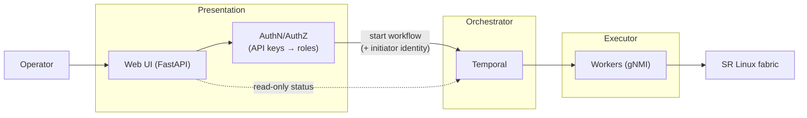

# ADR-0005: Lightweight Web UI as the Presentation Layer for Self-Service Automation

## Status

Accepted

## Date

2026-07-10

## Context

Mapped against the [NAF Framework](https://reference.networkautomation.forum/Framework/Framework/) building blocks, NSQuattro's **Presentation** block is essentially unstarted (#170). The only user-facing surfaces are vendor UIs (Grafana, Temporal UI, Infrahub UI) and Slack notifications via Alertmanager — all read-only or notify-only. Every automation workflow is initiated from the CLI (`uv run invoke ...` or `temporal workflow start`), which means:

- No self-service path for anyone who isn't a developer with a checked-out repo
- No authentication or authorization in front of workflow execution
- No record of *who* initiated a change in Temporal workflow history

Three approaches were considered for the first-class presentation layer:

| Approach | Strengths | Weaknesses |
|----------|-----------|------------|
| **Lightweight web UI** (FastAPI) | Self-contained in the compose stack, works fully offline, Python like the rest of the repo, clear authn/authz story, demo-friendly | One more service to build and operate |
| **ChatOps via Slack** (Socket Mode) | Identity free from Slack users, meets operators where they are | Requires a real Slack workspace + bot tokens; cannot run or demo offline; harder to test |
| **ITSM webhook** (ServiceNow/Jira-style) | Most enterprise-realistic entry point | No ITSM exists in this lab — would need a mock, weakest fit for local development |

The deployment model (ADR-0003: everything local via Docker Compose + OrbStack, no cloud) weighs heavily here: an approach that depends on external SaaS connectivity contradicts the platform's core constraint.

## Decision

Build the presentation layer as a **lightweight FastAPI web service** running in the Docker Compose stack:

1. **Scope** — authenticated REST API plus a minimal HTML UI exposing the initial self-service actions: trigger the deploy pipeline, request an operational override, and view drift/compliance status.
2. **Orchestrator-only integration** — the service starts Temporal workflows via the Temporal client. It never talks to devices (gNMI) or writes to Infrahub directly; the Orchestrator block remains the single path to change.
3. **AuthN/AuthZ** — per-user static API keys for the lab, mapped to roles (`viewer`, `operator`). The auth dependency is isolated so it can be swapped for OIDC later without touching route handlers. Unauthenticated or unauthorized requests are rejected with an auditable log line.
4. **Audit** — the authenticated initiator identity is included in every workflow's input payload, making it visible in Temporal workflow history for every triggered run.
5. **TDD** — per ADR-0004, the service is built test-first with FastAPI's `TestClient` and a mocked Temporal client.

ChatOps and ITSM integration are not rejected permanently — they become *additional* presentation instances later (the NAF Framework explicitly supports multiple instances per block), reusing the same authenticated API.

### Diagram

## Consequences

### Positive

- Automation can be initiated without a checked-out repo or CLI access
- First authn/authz boundary in front of workflow execution; rejected requests are observable
- Initiator identity recorded in Temporal history for every run — closes an audit gap
- Fully offline/local, consistent with ADR-0003; demo works without external accounts
- The authenticated API becomes the reusable foundation for future ChatOps/ITSM presentation instances

### Negative

- One more service in the compose stack to build, test, and keep healthy
- Static API keys are a lab-grade credential — production use requires the planned OIDC swap
- A minimal HTML UI will lag the CLI in capability; power users will still prefer `invoke` tasks initially
